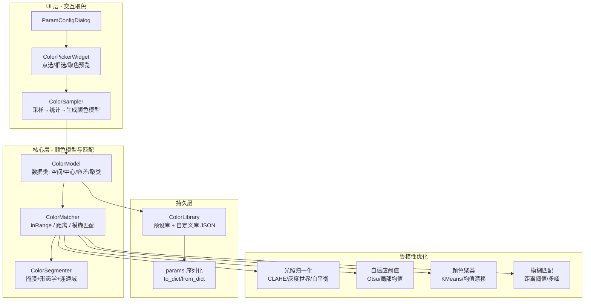
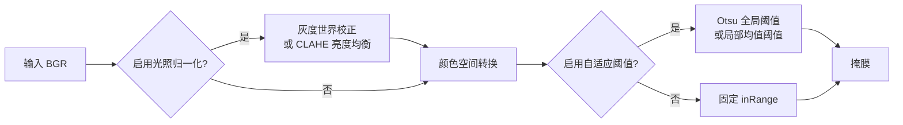
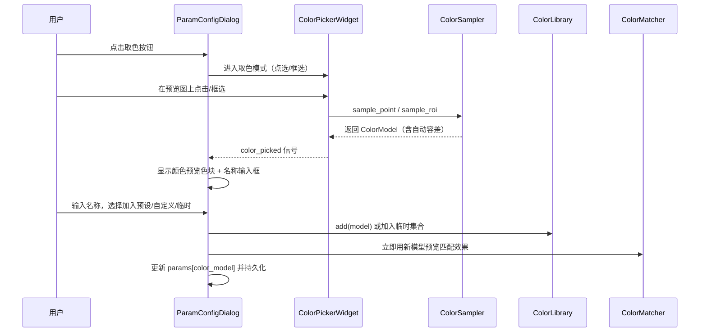
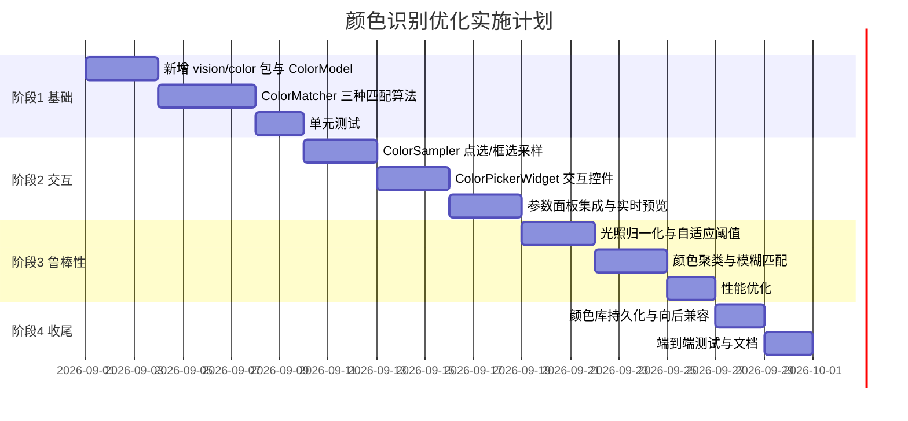

# 颜色识别算子系统性优化计划书

## 一、背景与目标

### 1.1 现状问题

当前 [`ColorRecognition`](../vision/tools/recognize.py:11) 算子存在以下核心问题：

1. **预设颜色硬编码**：`HSV_PRESETS` / `LAB_PRESETS` 仅含 8 种颜色（红/绿/蓝/黄/橙/紫/白/黑），新增目标色必须修改代码。
2. **固定阈值区间**：通过 `h_min/h_max/s_min/s_max/v_min/v_max` 六个参数描述一个**轴对齐的矩形盒**，无法表达任意形状的颜色簇；且 HSV 的 H 通道存在 0/180 环绕问题（红色跨 0 边界时需两个区间）。
3. **无光照自适应**：`cv2.inRange` 是绝对阈值，光照变化（曝光/增益/阴影）会直接导致漏检或误检。
4. **无噪声抑制**：仅用固定 5×5 开闭运算，对椒盐噪声、反光高光处理不足。
5. **交互缺失**：无法从图像上点选/框选目标色，测试适配繁琐。
6. **性能**：`findContours` + 逐轮廓 Python 循环，在大图/多目标时较慢。

### 1.2 目标

- 支持用户从图像上**点选 / 框选**任意颜色作为识别目标。
- 支持调整颜色匹配的**阈值 / 容差**（RGB 距离、HSV 色相范围等）。
- 支持将手动选取的颜色**动态加入预设颜色列表或临时自定义颜色集合**。
- 系统性提升不同光照、阴影、噪声、颜色空间转换下的**识别鲁棒性**。
- 保证**实时性**满足实际需求。
- 在现有代码基础上**平滑集成**，不破坏旧方案文件。

---

## 二、总体架构设计

### 2.1 分层架构



### 2.2 模块划分（新增文件）

| 文件 | 职责 |
|------|------|
| `vision/color/color_model.py` | `ColorModel` 数据类、颜色空间转换、模型序列化 |
| `vision/color/color_matcher.py` | 匹配算法：inRange / 距离 / 模糊匹配 / 聚类 |
| `vision/color/color_library.py` | 预设库 + 自定义库管理（JSON 持久化） |
| `vision/color/color_sampler.py` | 从 ROI/点采样像素，统计生成颜色模型 |
| `ui/widgets/color_picker_widget.py` | 交互取色控件（点选/框选/实时预览） |

> 说明：`vision/color/` 为新增包，需在 [`vision/__init__.py`](../vision/__init__.py) 中导出，并在 [`pipeline.py`](../vision/pipeline.py:86) 的 `_register_all_tools` 中注册（若新增独立算子）。

---

## 三、核心数据结构与接口设计

### 3.1 ColorModel 数据类

```python
# vision/color/color_model.py
from dataclasses import dataclass, field
from typing import List, Optional, Tuple
import numpy as np

@dataclass
class ColorModel:
    name: str                       # 颜色名称（如 "自定义-蓝"）
    color_space: str = "HSV"        # HSV / Lab / RGB
    center: Tuple[int, int, int] = (0, 0, 0)   # 颜色中心（对应空间）
    # 匹配方式: "range"(区间) / "distance"(距离) / "cluster"(聚类)
    match_mode: str = "range"
    # range 模式: 各通道容差（±）
    tolerance: Tuple[int, int, int] = (10, 50, 50)
    # distance 模式: 欧氏距离阈值
    distance_threshold: float = 30.0
    # cluster 模式: 聚类中心列表（多峰颜色，如带高光的红）
    cluster_centers: List[Tuple[int, int, int]] = field(default_factory=list)
    # 可选: 是否启用光照归一化
    normalize_illumination: bool = False
    # 可选: 是否启用自适应阈值
    adaptive_threshold: bool = False
    # 来源: "preset" / "custom" / "temporary"
    source: str = "custom"

    def to_dict(self) -> dict:
        return {
            "name": self.name, "color_space": self.color_space,
            "center": list(self.center), "match_mode": self.match_mode,
            "tolerance": list(self.tolerance),
            "distance_threshold": self.distance_threshold,
            "cluster_centers": [list(c) for c in self.cluster_centers],
            "normalize_illumination": self.normalize_illumination,
            "adaptive_threshold": self.adaptive_threshold,
            "source": self.source,
        }

    @classmethod
    def from_dict(cls, d: dict) -> "ColorModel":
        return cls(
            name=d.get("name", "未命名"),
            color_space=d.get("color_space", "HSV"),
            center=tuple(d.get("center", [0, 0, 0])),
            match_mode=d.get("match_mode", "range"),
            tolerance=tuple(d.get("tolerance", [10, 50, 50])),
            distance_threshold=d.get("distance_threshold", 30.0),
            cluster_centers=[tuple(c) for c in d.get("cluster_centers", [])],
            normalize_illumination=d.get("normalize_illumination", False),
            adaptive_threshold=d.get("adaptive_threshold", False),
            source=d.get("source", "custom"),
        )
```

### 3.2 匹配器接口

```python
# vision/color/color_matcher.py
class ColorMatcher:
    @staticmethod
    def build_mask(image_bgr: np.ndarray, model: ColorModel) -> np.ndarray:
        """根据颜色模型生成二值掩膜（核心入口）"""

    @staticmethod
    def match_distance(image_bgr, model) -> np.ndarray:
        """距离模式：逐像素计算到颜色中心的距离，返回距离图"""

    @staticmethod
    def cluster_mask(image_bgr, model) -> np.ndarray:
        """聚类模式：对每个聚类中心做距离匹配后取并集"""
```

### 3.3 颜色库接口

```python
# vision/color/color_library.py
class ColorLibrary:
    def __init__(self, path: str = "data/color_library.json"): ...
    def get_presets(self) -> List[ColorModel]: ...      # 内置预设
    def get_custom(self) -> List[ColorModel]: ...       # 用户自定义（持久化）
    def add(self, model: ColorModel) -> None: ...       # 加入自定义库并保存
    def remove(self, name: str) -> None: ...
    def get_temporary(self) -> List[ColorModel]: ...    # 临时集合（不持久化）
```

### 3.4 采样器接口

```python
# vision/color/color_sampler.py
class ColorSampler:
    @staticmethod
    def sample_point(image_bgr, x, y, radius=3) -> ColorModel:
        """点选：取 (x,y) 邻域像素均值/中位数，生成 range 模型"""

    @staticmethod
    def sample_roi(image_bgr, x, y, w, h) -> ColorModel:
        """框选：对 ROI 内像素做统计（均值/中位数/标准差/KMeans），
        自动推断容差，生成 range 或 cluster 模型"""

    @staticmethod
    def auto_tolerance(pixels: np.ndarray) -> Tuple[int, int, int]:
        """根据像素分布自动计算各通道容差（如 2~3 倍标准差）"""
```

---

## 四、关键算法设计

### 4.1 颜色空间选择

| 空间 | 优点 | 缺点 | 适用 |
|------|------|------|------|
| **HSV** | 色相分离，直观；H 对光照相对不敏感 | H 环绕问题；S/V 受光照影响 | 默认，适合饱和色 |
| **Lab** | 感知均匀，`a/b` 通道对光照较鲁棒；`L` 可单独处理 | 转换稍慢 | 光照变化大的场景 |
| **YCbCr** | 亮度/色度分离，`Cb/Cr` 对光照鲁棒 | 色度范围窄 | 肤色/特定色 |
| **RGB** | 直观 | 三通道强相关，光照敏感 | 仅作辅助 |

**推荐策略**：默认 HSV，提供 Lab 选项；对光照敏感场景自动切换到 Lab 或启用光照归一化。

### 4.2 HSV 色相环绕处理

红色在 HSV 中跨 H=0 边界（如 H∈[170,180]∪[0,10]），需拆分为两个区间：

```python
def build_hsv_mask(hsv, model):
    h_center, s_center, v_center = model.center
    h_tol, s_tol, v_tol = model.tolerance
    h_lo = (h_center - h_tol) % 180
    h_hi = (h_center + h_tol) % 180
    if h_lo <= h_hi:
        lower = np.array([h_lo, max(0, s_center - s_tol), max(0, v_center - v_tol)])
        upper = np.array([h_hi, min(255, s_center + s_tol), min(255, v_center + v_tol)])
        mask = cv2.inRange(hsv, lower, upper)
    else:
        # 跨 0 边界：两个区间取并集
        lower1 = np.array([h_lo, max(0, s_center - s_tol), max(0, v_center - v_tol)])
        upper1 = np.array([179, min(255, s_center + s_tol), min(255, v_center + v_tol)])
        lower2 = np.array([0, max(0, s_center - s_tol), max(0, v_center - v_tol)])
        upper2 = np.array([h_hi, min(255, s_center + s_tol), min(255, v_center + v_tol)])
        mask = cv2.bitwise_or(cv2.inRange(hsv, lower1, upper1),
                              cv2.inRange(hsv, lower2, upper2))
    return mask
```

### 4.3 距离匹配（模糊匹配）

对非规则颜色簇，用欧氏距离（在 Lab 空间更符合感知）：

```python
def match_distance(image_bgr, model):
    if model.color_space == "Lab":
        converted = cv2.cvtColor(image_bgr, cv2.COLOR_BGR2Lab)
    else:
        converted = cv2.cvtColor(image_bgr, cv2.COLOR_BGR2HSV)
    center = np.array(model.center, dtype=np.float32)
    # 逐像素距离（向量化，避免 Python 循环）
    diff = converted.astype(np.float32) - center
    dist = np.sqrt(np.sum(diff * diff, axis=2))
    return (dist <= model.distance_threshold).astype(np.uint8) * 255
```

### 4.4 颜色聚类（多峰颜色）

带高光/阴影的目标色（如金属红）在颜色空间呈多簇分布，用 KMeans 提取多个中心：

```python
def cluster_mask(image_bgr, model):
    mask = np.zeros(image_bgr.shape[:2], np.uint8)
    for center in model.cluster_centers:
        sub = ColorModel(name=model.name, color_space=model.color_space,
                         center=center, match_mode="distance",
                         distance_threshold=model.distance_threshold)
        mask = cv2.bitwise_or(mask, match_distance(image_bgr, sub))
    return mask
```

采样时自动聚类：

```python
def sample_roi(image_bgr, x, y, w, h, n_clusters=3):
    roi = image_bgr[y:y+h, x:x+w]
    pixels = roi.reshape(-1, 3).astype(np.float32)
    # 用 KMeans 找主色簇
    k = min(n_clusters, max(1, len(pixels) // 100))
    criteria = (cv2.TERM_CRITERIA_EPS + cv2.TERM_CRITERIA_MAX_ITER, 10, 1.0)
    _, labels, centers = cv2.kmeans(pixels, k, None, criteria, 3,
                                    cv2.KMEANS_PP_CENTERS)
    # 按簇大小排序，取主要簇
    counts = np.bincount(labels.flatten())
    order = np.argsort(counts)[::-1]
    main_centers = [tuple(int(v) for v in centers[i]) for i in order[:2]]
    # 用主簇像素标准差估计容差
    ...
```

### 4.5 光照归一化与自适应



- **灰度世界校正**：`R,G,B` 各通道均值归一化到同一水平，消除整体色偏。
- **CLAHE**：对 `V`（HSV）或 `L`（Lab）通道做对比度受限直方图均衡，抑制阴影/高光。
- **自适应阈值**：对掩膜候选区域用 Otsu 或局部均值重新二值化，适应局部光照不均。

### 4.6 噪声抑制与形态学

```python
# 中值滤波去椒盐噪声（比均值滤波保边更好）
denoised = cv2.medianBlur(image_bgr, 3)
# 形态学：先开运算去孤立噪点，再闭运算填补空洞
kernel = cv2.getStructuringElement(cv2.MORPH_ELLIPSE, (5, 5))
mask = cv2.morphologyEx(mask, cv2.MORPH_OPEN, kernel)
mask = cv2.morphologyEx(mask, cv2.MORPH_CLOSE, kernel)
```

### 4.7 性能优化

1. **ROI 裁剪**：仅对目标 ROI 做颜色匹配，避免全图计算（已有 `_input_source` 支持）。
2. **图像金字塔/降采样**：匹配前先降采样，粗定位后再精匹配。
3. **向量化**：用 `numpy` 广播替代 Python 循环（距离匹配已向量化）。
4. **掩膜缓存**：若输入尺寸不变且参数未变，缓存转换后的颜色空间图像。
5. **连通域替代 findContours**：用 `cv2.connectedComponentsWithStats` 一次得到区域统计，比逐轮廓 Python 循环快。

---

## 五、UI 交互设计（点选/框选取色）

### 5.1 ColorPickerWidget 控件

在 [`ParamConfigDialog`](../ui/widgets/param_config_dialog.py:13) 的预览区叠加一个可交互取色层，复用 [`MultiROIEditorLabel`](../ui/widgets/param_config_dialog.py:564) 的坐标换算思路（`_label_to_image`）：

```python
# ui/widgets/color_picker_widget.py
class ColorPickerWidget(QLabel):
    color_picked = pyqtSignal(object)   # 发出 ColorModel
    def __init__(self, image_bgr, parent=None):
        self._image = image_bgr
        self._mode = "point"            # point / rect
        self._rect = None
        self.setMouseTracking(True)

    def mousePressEvent(self, e):
        img_x, img_y = self._label_to_image(e.x(), e.y())
        if self._mode == "point":
            model = ColorSampler.sample_point(self._image, img_x, img_y)
            self.color_picked.emit(model)
        else:
            self._rect_start = (img_x, img_y)

    def mouseReleaseEvent(self, e):
        if self._mode == "rect" and self._rect_start:
            x0, y0 = self._rect_start
            x1, y1 = self._label_to_image(e.x(), e.y())
            x, y = min(x0, x1), min(y0, y1)
            w, h = abs(x1 - x0), abs(y1 - y0)
            model = ColorSampler.sample_roi(self._image, x, y, w, h)
            self.color_picked.emit(model)
```

### 5.2 交互流程



### 5.3 参数面板改造

在 [`get_param_widgets`](../vision/tools/recognize.py:187) 中新增：

- **取色模式**：`点选` / `框选` 切换按钮。
- **颜色库下拉**：预设 + 自定义 + 临时集合，选中即加载对应 `ColorModel`。
- **匹配方式**：`区间` / `距离` / `聚类`。
- **容差滑块**：H/S/V（或 L/a/b）各通道 ± 容差，实时预览。
- **距离阈值滑块**：distance 模式专用。
- **光照归一化 / 自适应阈值** 复选框。
- **"加入颜色库"按钮**：将当前模型保存到自定义库。

---

## 六、与现有代码的平滑集成

### 6.1 向后兼容策略

现有方案文件用 `h_min/h_max/s_min/s_max/v_min/v_max` 六个参数。为不破坏旧方案，采用**双轨制**：

```python
def process(self, context):
    # 优先使用新的 ColorModel（若存在）
    model_dict = self.params.get("color_model")
    if model_dict:
        model = ColorModel.from_dict(model_dict)
        mask = ColorMatcher.build_mask(img, model)
    else:
        # 回退到旧的六参数区间逻辑（保持原行为）
        mask = self._legacy_inrange(img)
```

这样旧方案无需迁移即可运行，新方案自动启用。

### 6.2 params 序列化

`ColorModel` 通过 `to_dict()` 存入 `self.params["color_model"]`，随 [`to_dict`](../vision/tools/base_tool.py:143) 自动持久化到方案 JSON，无需改动 [`PipelineStep.to_dict`](../vision/pipeline.py:147)。

### 6.3 注册与导入

- 新增 `vision/color/` 包，在 [`vision/__init__.py`](../vision/__init__.py) 导出。
- 若新增独立算子（如"多色识别"），在 [`pipeline.py`](../vision/pipeline.py:86) 的 `module_tools` 和 `_TOOL_CATEGORIES` 中注册。
- 若仅增强现有 `ColorRecognition`，则无需注册新算子，只需在 `recognize.py` 中引入新模块。

### 6.4 颜色库持久化

```json
// data/color_library.json
{
  "custom": [
    {
      "name": "基板蓝",
      "color_space": "HSV",
      "center": [110, 180, 150],
      "match_mode": "range",
      "tolerance": [8, 40, 40],
      "source": "custom"
    }
  ]
}
```

---

## 七、测试验证方案

### 7.1 单元测试（`tests/test_color_recognition.py`）

```python
def test_hsv_red_wraparound():
    """红色跨 H=0 边界应正确匹配"""
    img = np.zeros((100, 100, 3), np.uint8)
    img[:, :] = (0, 0, 255)  # BGR 纯红
    model = ColorModel(name="红", center=(0, 255, 255), tolerance=(10, 50, 50))
    mask = ColorMatcher.build_mask(img, model)
    assert mask.sum() > 0

def test_distance_match():
    """距离匹配应容忍轻微色差"""
    ...

def test_sample_roi_auto_tolerance():
    """框选采样应自动推断合理容差"""
    ...

def test_legacy_backward_compat():
    """旧六参数方案应保持原行为"""
    tool = ColorRecognition({"h_min": 0, "h_max": 10, ...})
    result = tool.process(ctx)
    assert result.success
```

### 7.2 鲁棒性测试

| 场景 | 方法 |
|------|------|
| 光照变化 | 对同一图像施加不同亮度/对比度，验证识别率 |
| 阴影 | 叠加渐变阴影，验证自适应阈值效果 |
| 噪声 | 添加高斯/椒盐噪声，验证中值滤波+形态学 |
| 颜色空间 | 对比 HSV / Lab 在不同光照下的表现 |
| 多峰颜色 | 高光金属色，验证聚类模式 |

### 7.3 性能基准

```python
def test_performance():
    img = np.random.randint(0, 255, (1920, 1080, 3), np.uint8)
    model = ColorModel(name="t", center=(100, 100, 100), tolerance=(10, 50, 50))
    t0 = time.time()
    for _ in range(100):
        ColorMatcher.build_mask(img, model)
    avg_ms = (time.time() - t0) / 100 * 1000
    assert avg_ms < 20  # 1080p 单次匹配 < 20ms
```

### 7.4 集成测试

- 在 [`ParamConfigDialog`](../ui/widgets/param_config_dialog.py:240) 的 `_update_preview` 中验证新模型实时预览。
- 保存/加载方案后验证 `color_model` 正确序列化与恢复。
- 用真实相机图像（`model/*.jpg`）做端到端验证。

---

## 八、实施路径（分阶段）



**阶段 1（基础）**：新增 `vision/color/` 包，实现 `ColorModel`、`ColorMatcher`（区间/距离/聚类）、单元测试。此阶段不触碰 UI，风险最低。

**阶段 2（交互）**：实现 `ColorSampler` 与 `ColorPickerWidget`，集成到 `ParamConfigDialog`，实现点选/框选取色与实时预览。

**阶段 3（鲁棒性）**：加入光照归一化、自适应阈值、聚类、模糊匹配，并做性能优化。

**阶段 4（收尾）**：颜色库持久化、向后兼容双轨制、端到端测试。

---

## 九、关键改动点汇总

| 文件 | 改动 |
|------|------|
| [`vision/tools/recognize.py`](../vision/tools/recognize.py:11) | `ColorRecognition.process` 增加 `color_model` 分支；`get_param_widgets` 增加取色/容差/匹配方式控件 |
| `vision/color/color_model.py`（新增） | `ColorModel` 数据类与序列化 |
| `vision/color/color_matcher.py`（新增） | 三种匹配算法 + 光照归一化 + 自适应阈值 |
| `vision/color/color_sampler.py`（新增） | 点选/框选采样 + 自动容差 + KMeans 聚类 |
| `vision/color/color_library.py`（新增） | 预设/自定义/临时颜色库管理 |
| `ui/widgets/color_picker_widget.py`（新增） | 交互取色控件 |
| [`ui/widgets/param_config_dialog.py`](../ui/widgets/param_config_dialog.py:13) | 预览区叠加取色层，接收 `color_picked` 信号 |
| [`vision/pipeline.py`](../vision/pipeline.py:86) | 若新增独立算子则注册；否则无需改动 |
| `data/color_library.json`（新增） | 自定义颜色库持久化文件 |
| `tests/test_color_recognition.py`（新增） | 单元/鲁棒性/性能测试 |

---

## 十、GitHub 代码备份（实施前）

在开始实施前，先将当前代码提交并推送到 GitHub。由于当前环境无终端执行能力，请在 VSCode 终端中依次执行以下命令：

```bash
# 1. 查看当前状态与远程
git status
git remote -v

# 2. 暂存所有改动（注意 .gitignore 已排除 dll/日志/构建产物等）
git add -A

# 3. 提交（提交信息可自定义）
git commit -m "feat: 颜色识别算子优化前代码备份"

# 4. 推送到远程（若远程分支名不同，按实际调整）
git push origin main
# 若默认分支为 master，则: git push origin master
```

> 若推送被拒绝（远程有更新），先执行 `git pull --rebase origin main` 再推送。

---

## 十一、结论

该方案在不破坏现有旧方案文件的前提下，通过**双轨制**平滑集成：新增 `ColorModel` 数据模型 + `ColorMatcher` 匹配引擎 + `ColorSampler` 采样器 + `ColorPickerWidget` 交互控件，实现从图像上点选/框选任意颜色作为识别目标，支持区间/距离/聚类三种匹配方式，可调容差，并能将自定义颜色持久化到颜色库。同时通过光照归一化、自适应阈值、颜色聚类、模糊匹配和向量化性能优化，系统性提升不同光照、阴影、噪声条件下的识别鲁棒性与实时性。整个方案分 4 个阶段实施，每阶段均可独立验证，风险可控。
