# PCBA导热硅胶检测设备 - 完整程序流程图

> 本文件用 Mermaid 绘制程序的完整执行流程，覆盖从启动到退出的所有路径。
> 已拆分为多个独立小图，每个图可快速渲染。
>
> **查看方式：** 安装 Mermaid 预览扩展后，打开本文件按 `Ctrl+Shift+V` 预览。

---

## 一、程序启动与初始化

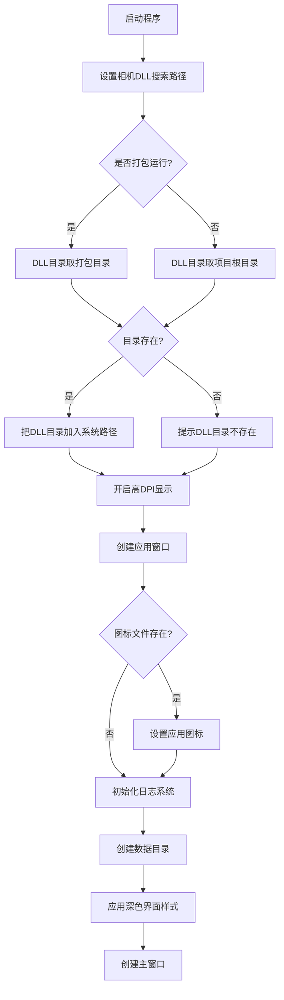

---

## 二、主窗口初始化

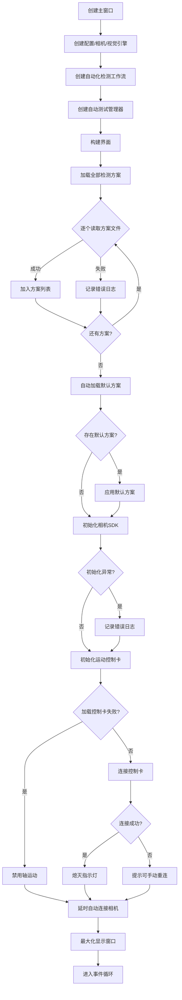

---

## 三、相机自动连接

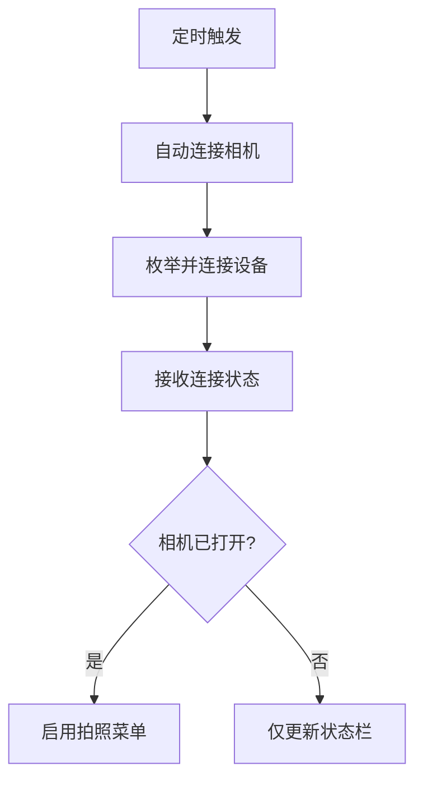

---

## 四、模式切换与用户登录

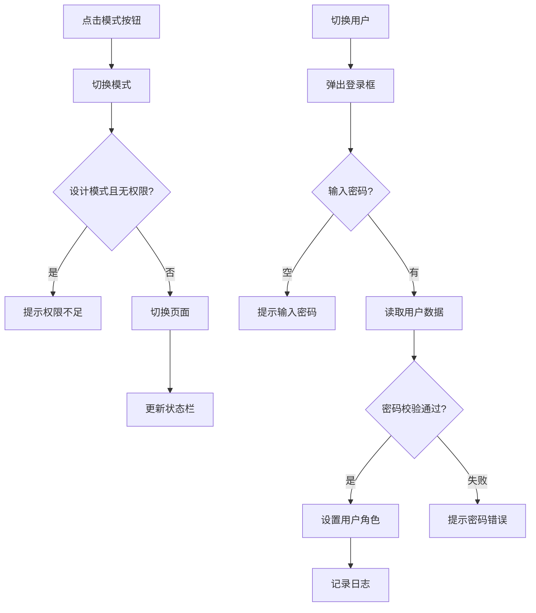

---

## 五、自动化检测工作流

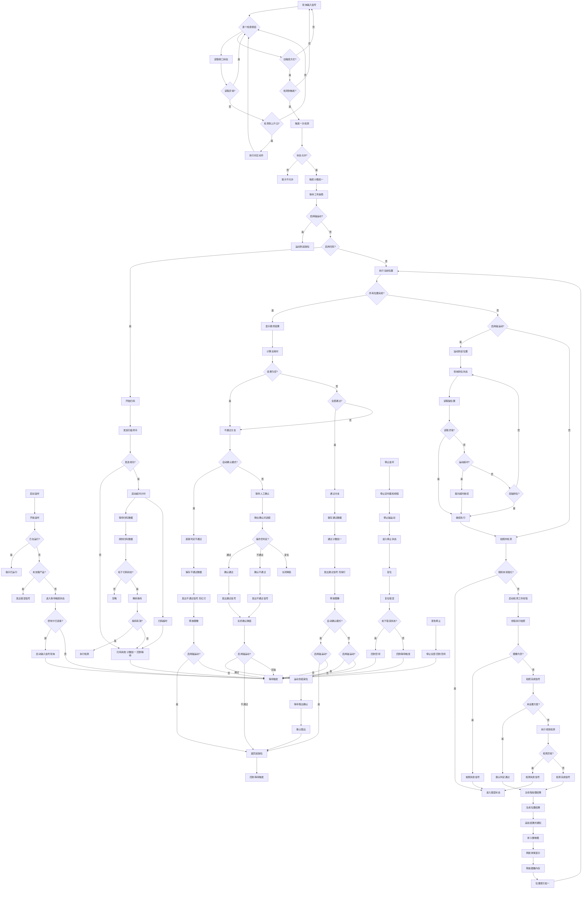

---

## 六、视觉引擎与流水线

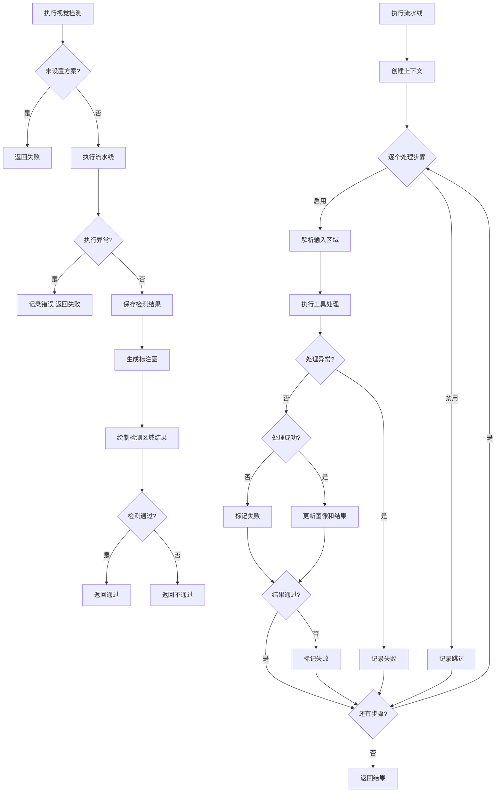

---

## 七、设计模式（工程师）

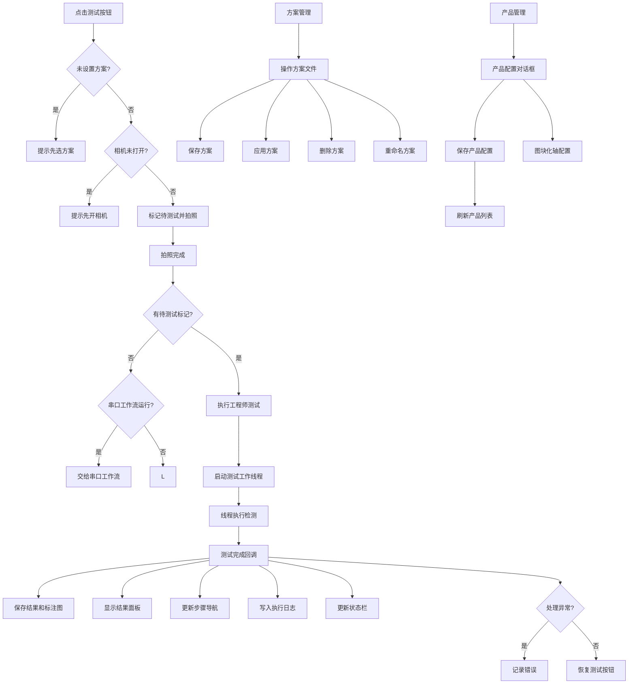

---

## 八、自动测试（可靠性测试）

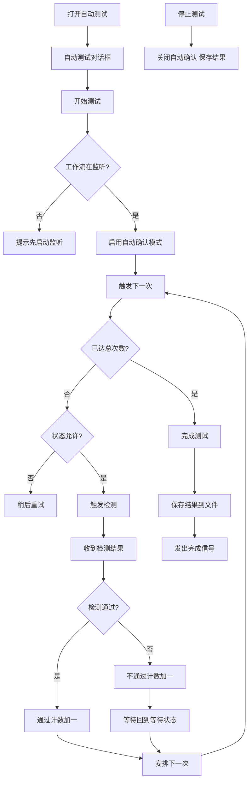

---

## 九、串口通信

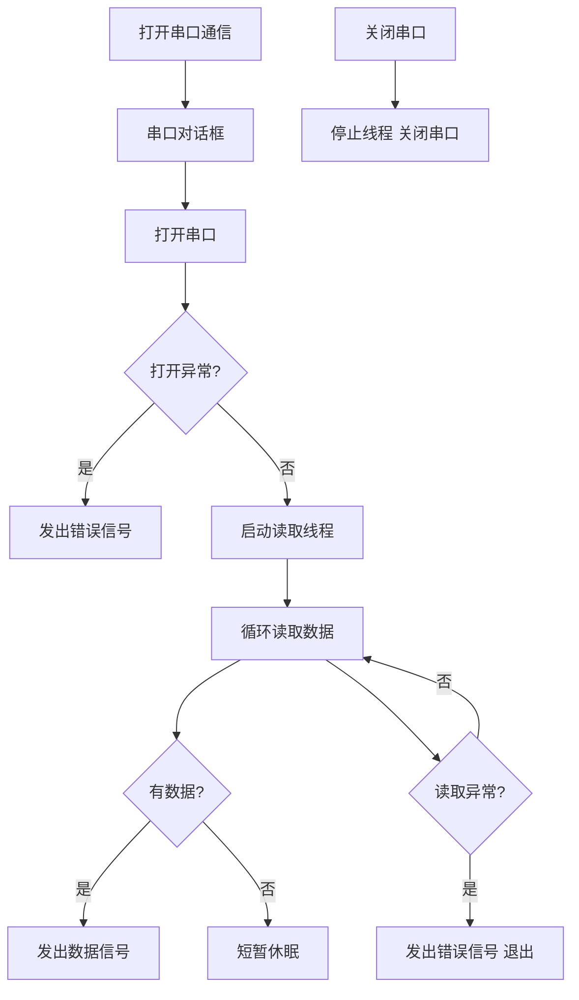

---

## 十、手动回零

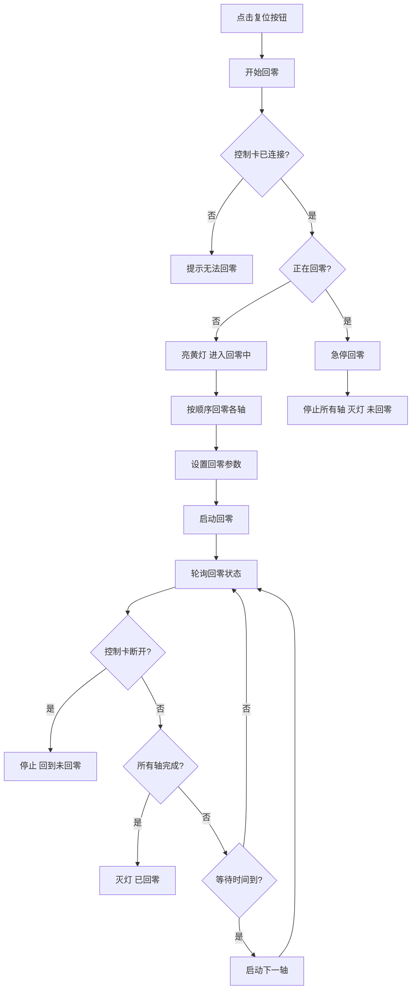

---

## 十一、指示灯控制

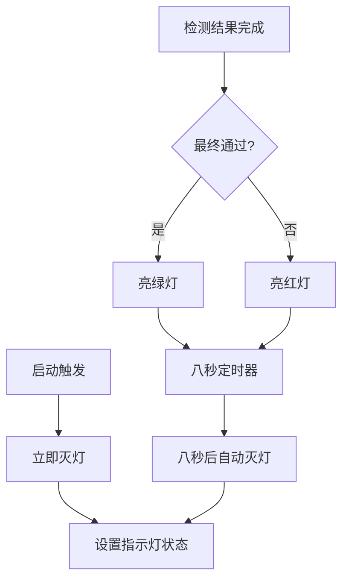

---

## 十二、数据存储 / 日志 / 退出

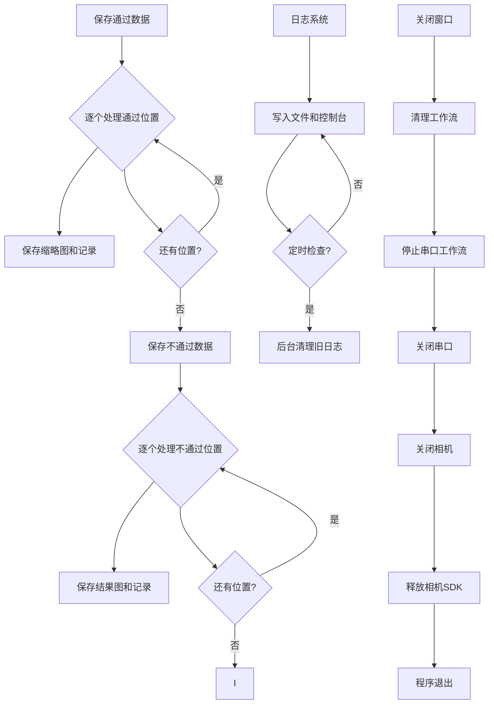
