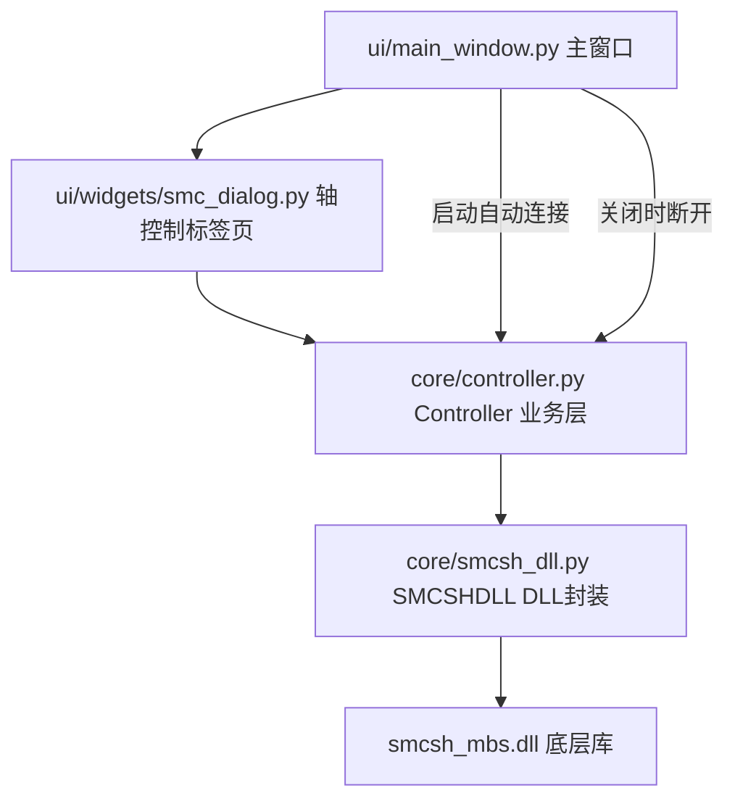

# SMC6480 四轴运动控制卡轴控制功能实施计划

## 一、目标

在现有视觉检测系统中集成 SMC6480 四轴运动控制卡，实现：

1. **软件启动自动连接** SMC6480（网口通信，IP 默认 `192.168.1.11`，写死在代码中）
2. **设计模式右侧新增「轴控制」标签页**（内嵌式，类似之前的轴控制标签页）
3. 轴控制功能包含：
   - 运动控制（JOG 点动、绝对/相对定位、停止）
   - 回零功能（硬件回零 + 软件回零）
   - 状态显示（控制器状态、轴状态、连接状态）
   - 位置显示（命令位置、编码器位置、速度）
   - 多轴切换（Axis0~2 = XYZ 三轴）
   - 伺服使能、软限位
   - 手动重连（启动时未连上时）

## 二、现状分析

| 文件 | 状态 | 说明 |
|------|------|------|
| [`core/smcsh_dll.py`](../core/smcsh_dll.py) | ✅ 完整（614行） | SMC6480 DLL 封装：连接、运动参数、点位运动、定速运动、停止/状态/位置、回零 |
| [`core/controller.py`](../core/controller.py) | ⚠️ 完整但有 bug（511行） | 业务层 Controller，**导入 bug**：`from smcsh_dll` 应为 `from core.smcsh_dll` |
| [`ui/widgets/smc_dialog.py`](../ui/widgets/smc_dialog.py) | ❌ 空壳（12行） | 需实现轴控制对话框 |
| `smcsh_mbs.dll` | ✅ 已放入项目根目录 | 运动控制卡动态链接库 |
| [`ui/main_window.py`](../ui/main_window.py) | ❌ 未集成 | 无自动连接、无轴控制标签页 |

## 三、架构设计

**分层原则**：UI 层（smc_dialog）只与业务层（Controller）交互，不直接接触底层 DLL。

## 四、实施步骤

### 步骤 1：修复 [`core/controller.py`](../core/controller.py) 导入 bug

- 将 `from smcsh_dll import (...)` 改为 `from core.smcsh_dll import (...)`
- 确保模块可被正确导入

### 步骤 2：实现 [`ui/widgets/smc_dialog.py`](../ui/widgets/smc_dialog.py) 轴控制对话框

设计为可复用的轴控制面板（QWidget），包含：

**连接状态区**
- 连接状态显示（已连接/未连接）
- 控制器状态显示（待机/运行/手动等）
- 手动重连按钮

**多轴切换区**
- 轴选择下拉框：Axis0 / Axis1 / Axis2（对应 XYZ 三轴）

**位置/状态显示区**
- 命令位置（脉冲）
- 编码器位置
- 当前速度
- 轴状态（停止/运动中/暂停）

**运动控制区**
- 速度、加速度、目标位置输入框
- JOG + / JOG -（按压触发）
- 绝对定位、相对定位
- 停止按钮

**回零控制区**
- 硬件回零（`Motion_Home_FindOrigin`）
- 软件回零（移动到 0 坐标）
- 设为零点（将当前位置设为 0）

**伺服/限位区**
- 伺服使能开关
- 软限位设置

**定时刷新**：使用 QTimer 定时（如 200ms）刷新位置/状态显示。

### 步骤 3：集成到 [`ui/main_window.py`](../ui/main_window.py)

- 在设计模式右侧标签页（`eng_right_tabs`）新增「🎮 轴控制」标签页
- 复用 `smc_dialog.py` 中的轴控制面板

### 步骤 4：启动自动连接 + 手动重连

- 在 `MainWindow.__init__` 中创建 `Controller` 实例
- 启动时自动连接（IP `192.168.1.11` 写死）
- 连接失败时记录日志，UI 提供手动重连按钮
- 关闭窗口时断开连接

### 步骤 5：更新 [`main.spec`](../main.spec) 打包配置

- 加入 `smcsh_mbs.dll` 到 binaries（类似之前 NMC DLL 的打包方式）

### 步骤 6：验证

- 语法检查（`py_compile`）
- 导入测试
- 确认无残留 NMC 引用

## 五、关键决策（已与用户确认）

| 决策点 | 结论 |
|--------|------|
| 连接方式 | 网口通信，IP `192.168.1.11` 写死 |
| UI 呈现 | 设计模式右侧内嵌标签页 |
| 轴数量 | 3 轴 Axis0~2（XYZ） |
| 回零方式 | 硬件回零 + 软件回零（移动到 0 坐标） |
| 与检测工作流联动 | 后期再改，本次仅完成轴控制功能 |
| 手动重连 | 需要（启动未连上时） |
| DLL 文件 | 已放入项目根目录 |

## 六、注意事项

- `smcsh_mbs.dll` 为 32 位或 64 位 DLL，需与 Python 位数匹配（`smcsh_dll.py` 已含位数检测）
- 轴控制标签页仅在设计模式（工程师）下可见
- 运动控制操作需在控制器已连接状态下进行，未连接时按钮禁用并提示
