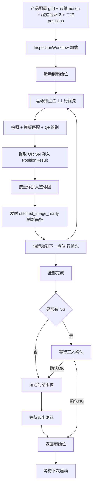

# 多板卡托盘检测：图像拼接 + QR 识别 + XML 导出 + 轴运动控制 实施方案

## 一、业务场景

本设备为**托盘 + 多板卡**检测：一次测试托盘上有多张独立板卡，每个点位对应一张板卡。
每个点位（板卡）执行相同的检测需求：**模板匹配 + QR 二维码识别**。
QR 识别结果作为该板卡的 SN（ID），用于保存图片与生成 XML（供 MES 上传）。

检测完成后，将各点位的检测后图像按轴坐标**刚性拼接**成一张"托盘总览图"，
在自动化检测面板主区域显示，每个板卡区域左上角标注该板卡的 OK/NG，方便工人快速辨别哪些板卡有错误。

## 二、需求汇总（已与用户确认）

### 1. 轴参数配置改造
- 运动参数（速度/加速度/原点/超时）**X、Y 两轴各配置一次**，不需要每个点位配置。
- `motion` 结构支持两轴：`x_axis`、`y_axis` 及各自 `v_max`、`a_max`、`origin_position`、`move_timeout_s`。
- `positions` 一维列表改为**二维网格**：
  - 配置 `grid: {rows, cols}`。
  - 每个点位保存 `row`、`col`、`name`、`x`、`y`、`scheme`。
  - 点位名称按"行.列"规则生成，如 1.1、1.2、2.1。
- 轴控制方案改为**图块化配置**：配置为 x 行 y 列时，弹出轴配置窗口，填写 x*y 个点位的 X、Y 轴参数。
- **新增起始位和结束位**（X/Y 两个坐标）。

### 2. 图像拼接机制
- 拼接**不作为视觉算子**加入流水线。
- 自动化运行模式下自动拼接。
- 基于各点位 X/Y 轴坐标**刚性拼接**，自动计算偏移/重叠量，无需人工逐项填写。
- 拼接顺序**行优先**：1.1 → 1.2 → 1.3 → 2.1 → 2.2 → …
- **每测完一个点位立即拼入整体图并刷新显示**（不是全部测完再拼）。
- 拼接逻辑随当前产品方案的 `grid` 行列数和点位坐标**动态变化**。
- **拼接整图不保存**，仅屏幕显示。

### 3. 自动化流程显示逻辑
- 拼接图显示在自动化检测面板**主区域**（替换原各点位独立格子）。
- 每完成一个点位，面板图片更新一次，展示最新拼接结果。
- 手动测试模式保持原逻辑，不自动拼接。

### 4. QR 识别算子及保存逻辑
- 新增 QR 识别算子/工具，接入现有视觉工具流程。
- 每个点位（板卡）都识别一次 QR，作为该板卡 SN。
- 保存逻辑：每个点位按各自 QR SN 保存到 `{ID}/` 目录。
- **每个目录下生成一个 XML 文件**，格式：
  `<test test_sn="**********" test_date="YYYY/MM/DD HH:MM:SS" test_result="OK/NG" imgurl="******"/>`
  - `imgurl` = 图片**绝对路径**
  - XML 以 SN 命名，放 `{ID}/` 目录
  - 每个点位（板卡）一个 XML
- 拼接整图不保存。

### 5. 运动控制流程（已确认）
1. 测试开始时，运动到**起始位**。
2. 根据 OK/NG 移动到各点位，**轴运动按行优先顺序遍历各点位**（1.1 → 1.2 → 1.3 → 2.1 → …，与拼接顺序一致）。
3. **若 OK**：测试结束后运动到**结束位**，等待工人按下"取出确认"按钮，返回**起始位**。
4. **若 NG**：测试结束后停止，等待工人确认 OK/NG：
   - 工人确认 **OK** → 运动到结束位，等待工人按下"取出确认"按钮，返回起始位。
   - 工人确认 **NG** → 返回起始位，等待下一次工人按下启动按钮。

## 三、产品配置新结构

```json
{
  "name": "产品A",
  "description": "",
  "camera": { "exposure_time": 18000, "gain": 0 },
  "grid": { "rows": 3, "cols": 4 },
  "motion": {
    "x_axis": 0,
    "y_axis": 1,
    "x": { "v_max": 50000, "a_max": 100000, "origin_position": 0, "move_timeout_s": 10 },
    "y": { "v_max": 50000, "a_max": 100000, "origin_position": 0, "move_timeout_s": 10 }
  },
  "home": { "start_x": 0, "start_y": 0, "end_x": 100000, "end_y": 0 },
  "positions": [
    { "row": 1, "col": 1, "name": "1.1", "x": 0,    "y": 0,    "scheme": "方案1" },
    { "row": 1, "col": 2, "name": "1.2", "x": 1000, "y": 0,    "scheme": "方案1" },
    { "row": 1, "col": 3, "name": "1.3", "x": 2000, "y": 0,    "scheme": "方案1" },
    { "row": 1, "col": 4, "name": "1.4", "x": 3000, "y": 0,    "scheme": "方案1" },
    { "row": 2, "col": 1, "name": "2.1", "x": 0,    "y": 1000, "scheme": "方案1" },
    ...
  ],
  "di_bit": 3,
  "poll_interval_ms": 50
}
```

**兼容迁移**：旧配置 `positions` 为 `[{name, position, scheme}]`、`motion` 为单轴。
加载时若检测到旧结构，自动迁移为二维网格（单行多列，`grid.rows=1, grid.cols=N`，
`x=position, y=0`），并保留旧字段以便回写。

## 四、模块改造清单

### 4.1 `core/product_manager.py`
- `create_default_config()`：生成新结构（grid、双轴 motion、home 起始/结束位、二维 positions）。
- 新增 `migrate_config(config)`：旧结构 → 新结构迁移。
- `load_product()`：加载后调用迁移。

### 4.2 `ui/main_window.py` — 产品配置对话框
- 新增 `grid` 行列配置（rows/cols 输入框）。
- 新增"图块化轴配置"按钮：点击弹出轴配置窗口，按 rows×cols 生成点位表格，
  每行填写 X、Y 坐标（可联动起始位/结束位），保存后写入 `positions`。
- 新增起始位/结束位配置（X/Y 坐标）。
- `motion` 区改为 X、Y 两轴参数。
- `_on_ok()` 按新结构保存。

### 4.3 `vision/tools/recognize.py` — 新增 QR 识别算子
- 新增 `QRCodeRecognize(VisionTool)`：
  - 使用 `cv2.QRCodeDetector` 识别。
  - 输出 `ToolResult.data["qr_data"] = "SN"`，overlay 框出二维码。
  - 支持 ROI 输入源（复用 `_get_input_image`）。
  - 提供 `get_param_widgets`（阈值/ROI 等可选）。

### 4.4 `vision/pipeline.py` — 注册 QR 算子
- `CN_TO_EN` 增加 `"二维码识别": "QRCodeRecognize"`。
- `_TOOL_CATEGORIES["识别"]` 增加 `"QRCodeRecognize"`。
- `_register_all_tools()` 的 `recognize` 模块列表增加 `"QRCodeRecognize"`。

### 4.5 新增 `vision/stitch.py` — 图像拼接模块
- `class RigidStitcher`：
  - 输入：`List[{image, x, y, passed}]`（按行优先顺序）+ 图像尺寸。
  - 根据各点位 X/Y 坐标计算画布尺寸与偏移，刚性放置。
  - 支持重叠区域处理（后图覆盖前图或取平均，默认后图覆盖）。
  - 输出拼接整图。
- `class StitchLayout`：根据 `grid` 行列 + 点位坐标动态计算布局。
- 提供 `annotate_board_status(stitched, placements, results)`：
  在每个板卡区域左上角绘制 OK/NG 标签（绿/红）。

### 4.6 `core/inspection_workflow.py` — 工作流改造
- `load_product()`：读取新结构（grid、positions 二维、motion 双轴、home）。
- 新增拼接状态：`self._stitcher`、`self._stitched_image`。
- `_on_test_completed()`：每个点位完成后：
  - 从 `tool_results` 提取 `qr_data` 存入 `PositionResult`。
  - 将该点位标注图按坐标拼入整体图。
  - 发射新信号 `stitched_image_ready(np.ndarray)` 通知面板刷新。
- 新增运动控制状态机（见 4.8）。
- 保存逻辑：`_save_ng_ok_data()` / `_save_ng_error_data()` 改为按各点位 QR SN 保存 + 生成 XML。

### 4.7 `core/result_storage.py` — 保存 + XML
- 新增 `save_board_data(scheme_name, sn, annotated_image, passed, img_path)`：
  - 按 `{SN}/` 目录保存缩略图/结果图。
  - 生成 `{SN}.xml`，格式 `<test test_sn="..." test_date="..." test_result="..." imgurl="绝对路径"/>`。
- 保留旧 `save_ok_data` / `save_ng_data` 兼容。

### 4.8 轴运动控制接入（`core/inspection_workflow.py` + `core/controller.py`）
- 工作流持有 `Controller` 引用（由主窗口注入）。
- 新增运动状态机：
  - `MOVE_TO_START` → 各点位 `MOVE_TO_POSITION` → 拍照检测 → 下一点位
  - 全部完成 → OK：`MOVE_TO_END` → `WAIT_TAKEOUT` → `MOVE_TO_START`
  - NG：`WAIT_CONFIRM` → 确认 OK：`MOVE_TO_END` → `WAIT_TAKEOUT` → `MOVE_TO_START`；确认 NG：`MOVE_TO_START`
- 使用 `pmove_abs` 双轴运动（X、Y 轴号来自 motion 配置）。
- 运动到位检测：`check_down` 轮询或延时。

### 4.9 `ui/inspection_panel.py` — 显示改造
- 主区域改为显示拼接整图（替换原各点位格子网格）。
- 新增 `show_stitched_image(np.ndarray)`：等比缩放显示。
- 连接 `stitched_image_ready` 信号，逐点刷新。
- 手动测试模式保留原网格逻辑（不拼接）。

### 4.10 `ui/main_window.py` — 注入 Controller 到工作流
- 将 `self._smc_controller` 注入 `InspectionWorkflow`。
- 连接"取出确认"按钮信号。

## 五、数据流



## 六、实施步骤（已完成）

1. ✅ 设计产品配置新结构（grid、双轴 motion、起始/结束位、二维 positions）。
2. ✅ 改造 `core/product_manager.py`（默认配置 + 兼容迁移 `migrate_config`）。
3. ✅ 改造 `ui/main_window.py` 产品配置对话框（行列 + 图块化轴配置窗口 + 起始/结束位）。
4. ✅ 新增 QR 识别算子 `QRCodeRecognize` 并注册到 `vision/pipeline.py`。
5. ✅ 新增 `vision/stitch.py` 刚性拼接模块（`RigidStitcher`）。
6. ✅ 改造 `core/inspection_workflow.py`（逐点拼接、QR 提取、运动状态机）。
7. ✅ 改造 `core/result_storage.py`（按 SN 保存 + 生成 XML）。
8. ✅ 改造 `ui/inspection_panel.py`（主区域显示拼接整图 + 板卡 OK/NG 标注 + 取出确认按钮）。
9. ✅ 接入轴运动控制到自动化工作流（起始位/点位/结束位/取出确认）。
10. ✅ 更新 `main.spec`（加入 `vision.stitch` hidden import）。
11. ✅ 编写/更新 plans 文档与验证。

## 八、实现要点记录

- **产品配置新结构**：`grid:{rows,cols}`、`motion:{x_axis,y_axis,x:{...},y:{...}}`、`home:{start_x,start_y,end_x,end_y}`、`positions:[{row,col,name,x,y,scheme}]`。
- **兼容迁移**：`migrate_config()` 将旧单轴/一维 positions 迁移为单行多列网格。
- **QR 算子**：`QRCodeRecognize` 输出 `ToolResult.data["qr_data"]`，工作流 `_extract_qr_data()` 提取作为板卡 SN。
- **拼接**：`RigidStitcher` 基于 X/Y 轴坐标刚性拼接，`render_annotated()` 在每个板卡左上角标注 OK/NG；工作流每测完一个点位调用 `_add_to_stitch()` 并发射 `stitched_image_ready` 刷新面板。
- **保存**：`ResultStorage.save_board_data()` 按 SN 保存图片 + 生成 `<test test_sn="..." test_date="..." test_result="..." imgurl="绝对路径"/>` XML。
- **运动控制**：工作流 `set_controller()` 注入控制器；`_move_to()` 双轴绝对定位 + `check_down` 轮询到位；流程为 起始位→各点位(行优先)→OK:结束位→取出确认→起始位 / NG:等待确认→确认OK走结束位流程/确认NG回起始位。
- **显示**：检测面板主区域改为 `ZoomableLabel` 显示拼接整图，新增"取出确认"按钮。

## 七、待确认/风险点

- 拼接重叠区域处理策略（后图覆盖 vs 平均）——默认后图覆盖，可后续调整。
- 运动到位检测方式（`check_down` 轮询 vs 固定延时）——默认轮询 + 超时。
- 旧产品配置迁移的字段保留策略。
- XML 中 `imgurl` 使用绝对路径（已确认）。
